# UofA IEEE Git Workshop

This page serves as the information presented for the UofA IEEE Git workshop.

Follow along and I hope you learn something!

This is a guide that's meant to be followed along. There are a lot of codes blocks here, and any line that starts with `$` is something that you are meant to execute.

```bash
$ This is a command to run in your terminal
# This is a comment
```

# What is Git?
Git is an open source distributed **Version Control System** (VCS) that tracks
changes in files. Often used in teams to coordinate work and efficiently
develop code in the same project.

Resources:
* https://illustrated-git.readthedocs.io/en/latest/

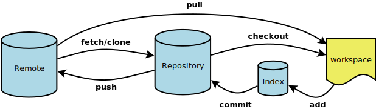


# What is GitHub?
Github is a hosting service for git, which also adds a custom frontend and other
advanced features. **git != github.**

# Git Alternatives
When learning about a new technology, it's nice to know the alternatives.

|Alternative|Information|
|-----------|-----|
|Subversion|If you used TortoiseSVN you have used Subversion|
|Mercurial|BitBucket/SourceForge/GNU Octave used this|
|Bazaar|Maintained by Canonical|
|RTC|Rational Team Concert - Made by IBM|

## Setting up SSH Keys
<details>
  <summary>Click me to expand</summary>

# 1) SSH Keys
SSH keys are great, and you should use them. They aren't scary, so let's go set
one up! publickey authentication consists of a pair of keys

|Key|Meaning|
|-----------|-----|
|Public|This key by default has the `.pub` suffix and is safe to share*|
|Private|Protect this key and ensure no one else gets access to it. This is what logs you in.|

*If someone has your public key, they can't login to anything, however don't
just share your key with random people.

There are many algorithms to key pairs, but today we will be using the tried
and true RSA algorithm.

## 1A) Generating RSA keypair
First, let's generate the key pairs in our `~/.ssh/` folder, so run the following command:
```bash
$ cd `/.ssh/`
```

In your terminal (**Git Bash** if you are using Windows) run the following
command to generate the SSH key pair:

```bash
$ ssh-keygen -t rsa
```
I named the key `mykey` and did not password protect the key (just pressed enter)
```bash
Generating public/private rsa key pair.
Enter file in which to save the key (/c/Users/mitch/.ssh/id_rsa): mykey
Enter passphrase (empty for no passphrase):
Enter same passphrase again:
Your identification has been saved in mykey
Your public key has been saved in mykey.pub
The key fingerprint is:
SHA256:Bro1WkPnemLmPGnZ80lVQ6iNVIbVrcSxBPYQqQ9jfiA mitch@Rainstorm
The key's randomart image is:
+---[RSA 3072]----+
|           +OB+o |
|          ooo=+..|
|      o .. = .=. |
|     o +E O .... |
|    . = S+ =.    |
|     = =  ..o    |
|    o =+. ..     |
|     ==oo. .     |
|     .o. oo      |
+----[SHA256]-----+
```

Now if I look in my $(cwd) I'll see both the public and private key.
```bash
$ ll
total 5
-rw-r--r-- 1 mitch 197609 2602 Feb 13 10:15 mykey
-rw-r--r-- 1 mitch 197609  569 Feb 13 10:15 mykey.pub
```

The key with the `.pub` suffix is the public key which I will enroll with
Github.

First, `cat` the public key so you can copy it
```bash
cat mykey.pub
ssh-rsa AAAAB3NzaC1yc2EAAAADAQABAAABgQC0lR2YEsFG4gEYJEKUudcuFwsuFyOXacVii2EMqXneNY03Uu16xnMKlko4O7ypx8HgDf8g/xV1/f+L+TPIWlp0ebpuwu7ADC5YtREa9SrD0mA7vQyKLKGDUU5faqFYAaNVUrHe6IimZk1b2dz0/ha0unCa8NKipLwJRpTPt3gTwYxWjDl699WYMf8uw8OU8Bs/Mr8ItX3Js6k8Ctj0RRj4vtuUcjzDEhbj6wIKvWy4QuxRbvfCMXWILDVMJLHCLiC6Rv0/hYOZJFRk+jVJW0xwEcC/kKG5Z//yOxB7LdrMF3/M2mw6NhKkpVTvz5Lx4iM76OhMx1UtFWSN2jd639RfDAqD9nZpPxDxFeT8DzOtqMbuI47emkeCz2k2zb673sNPGEDcOR0kD9uLTTeXeZWQ20+pxURWGresetHhfCBsnMe0qhE25vStJnrqq1eFVlpIaKfN55m2JFMqVn7Bljn8nCirG6VCObepJrfaWZ21nFVcX5y48ydEaQPczdrvwH0= mitch@Rainstorm
```
## 1B) Enrolling SSH public key
Now, go to https://github.com/settings/keys


And then enroll your key by adding the name for this keypair (I chose the name of the key) and pasting your publickey

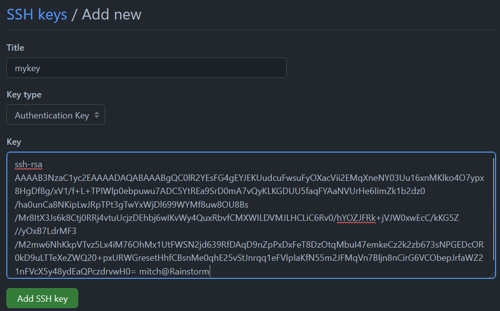

Simply click  and your public key is now enrolled with Github!

# 1C) Configuring local git to use private key
Now that Github has our **Public Key** enrolled, it is time to configure our local git to use our private key. First `cd` to `~/.ssh/`
```bash
cd ~/.ssh/
```
This is where your ssh configuration file will live. Depending on your system, it might be a different path, so let's determine what our home directory is
```bash
$ echo $PWD
/c/Users/mitch/.ssh
```

For me it's `/c/Users/mitch/.ssh` so I will use that in my configuration file, but it may be different for you.

At this point, use whatever text editor you prefer (I use vim) to create the config file in `~/.ssh/` to look like so:
```bash
$ cat ~/.ssh/config
Host github.com
        User git
        Hostname github.com
        PreferredAuthentications publickey
        IdentityFile C:\Users\mitch\.ssh\mykey
```
Notice how I use `\` instead of `/` here, that's because I'm on Windows. If you're on Mac/Linux then you can use `/`.

That's it! Congratulations on enrolling your key pair. Common mistakes are typos in the config file, and not having the key in the right place. You can double check this by

</details>

---

## Creating our first Repo
<details>
  <summary>Click me to expand</summary>
Now it's time to create our repo!

Go to https://github.com/new, create a repository and give it a name


You can make your repo Private if you want. After this, click Create Repository to create it!


At this point you will see

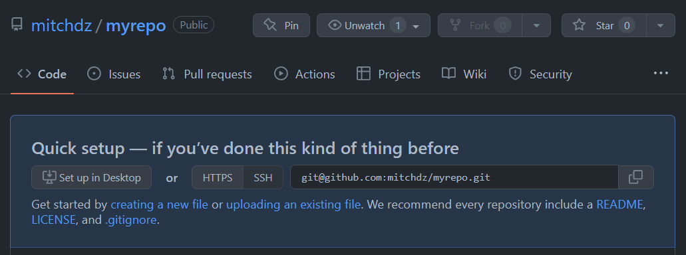

We will now use our first git command to clone the remote repository. Copy that URL and use `git clone` to download the remote to your local machine.

```bash
$ mkdir -p ~/git/
$ git clone git@github.com:mitchdz/myrepo.git
```

Now cd to your new repo
```bash
$ cd myrepo # or whatever name you made it
```

And create your first file

```bash
$ vim README.md
# write whatever you want, for example:
$ cat README.md
# myrepo

This is my repo!
```

Now you can use `git status` to see what the working tree looks like

```bash
$ git status
On branch main

No commits yet

Untracked files:
  (use "git add <file>..." to include in what will be committed)
        README.md

nothing added to commit but untracked files present (use "git add" to track)
```

Here we can see `README.md` is in our local repository and unstaged. We can add
The file(s) to staging with `git add`

```bash
$ git add README.md
```

Now check back with `git status`
```bash
$ git status
On branch main

No commits yet

Changes to be committed:
  (use "git rm --cached <file>..." to unstage)
        new file:   README.md
```

At this point, the file `README.md` is in staging and we can add more files
or make other changes. We will proceed to commit these changes to our **local branch** with git commit.

## Making a Commit Message
```bash
$ git commit -s
```

The `-s` flag **s**igns the commit message with your key. This is often required
in certain projects.

Every project has a different guideline for commit messages, so check in
with the project to see what they expect. Here we will use a simple framework
that looks like:

```text
[Files changed]: [brief description]

[More in-depth description]
```

For a real-life example, check out a recent cloud-init commit: https://github.com/canonical/cloud-init/commit/55686b977570a6de69bef51c1e1a9d452333995d

For this exercise, the following commit message is good:
```bash
README: init commit

Initial commit of README.

Signed-off-by: mitchdz <mitch_dz@hotmail.com>

# Please enter the commit message for your changes. Lines starting
# with '#' will be ignored, and an empty message aborts the commit.
#
# On branch main
#
# Initial commit
#
# Changes to be committed:
#       new file:   README.md
#
```

Now we can push our local commit to the remote repository with `git push`

```bash
$ git push
Enumerating objects: 3, done.
Counting objects: 100% (3/3), done.
Writing objects: 100% (3/3), 273 bytes | 273.00 KiB/s, done.
Total 3 (delta 0), reused 0 (delta 0), pack-reused 0
To github.com:mitchdz/myrepo.git
 * [new branch]      main -> main
```

Refresh your github page (the one that gave you the URL) and you will see the
changes!

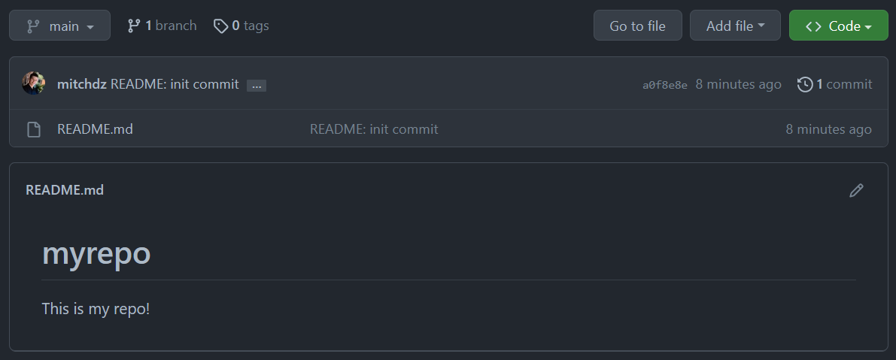

</details>

---

# Pulling remote changes

<details>
  <summary>Click me to expand</summary>
Now let's simulate working on a project and someone creates a new file and
and modifies and existing one. Go to your Github page and add a file

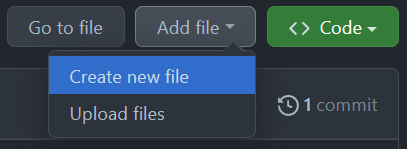

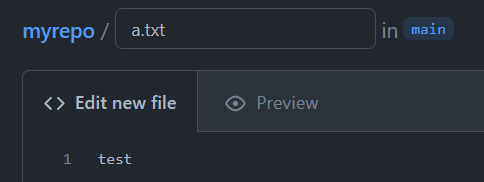

And commit directly to main

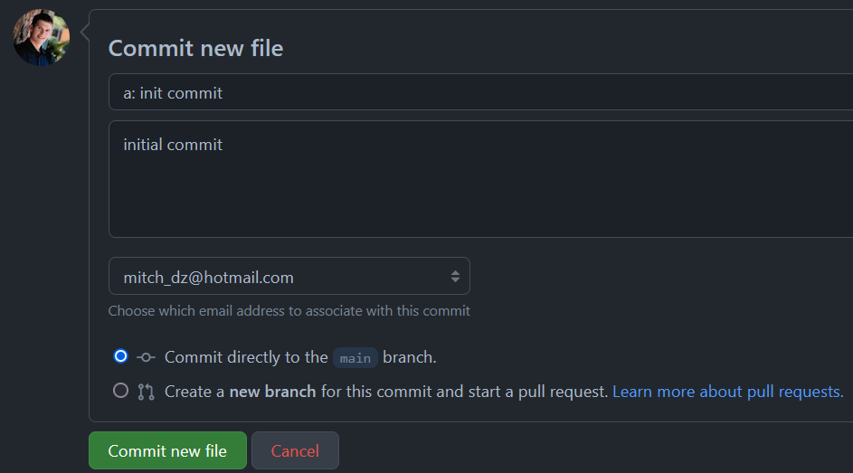

Cool, now the remote has a new file named `a.txt` with the contents "test". Let's also modify the README with the GitHub frontend. Click the pencil icon on the right of the README.md  to start editing. Write whatever you want and commit the changes.

Now at this point you will see 3 commits in the Repository

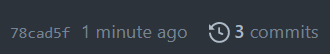

And you can view the commits by clicking the `3 commits`

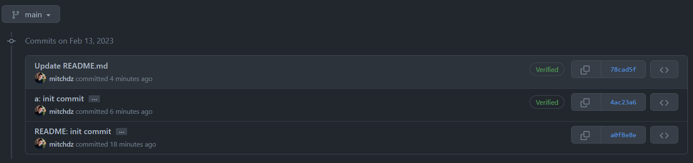


## Syncing Remote changes to Local

Okay now let's sync these remote changes to our local branch.

Going back to our terminal (our machine with the local branch) let's see what
`git status` tells us

```bash
$ git status
On branch main
Your branch is up to date with 'origin/main'.

nothing to commit, working tree clean
```

This might be a little misleading, because we just made 2 commits to main! The
Reason for this is because our local branch doesn't know of the changes yet, so
we need to `fetch` those changes.

```bash
$ git fetch
remote: Enumerating objects: 8, done.
remote: Counting objects: 100% (8/8), done.
remote: Compressing objects: 100% (4/4), done.
Unpacking objects: 100% (6/6), 1.29 KiB | 77.00 KiB/s, done.
remote: Total 6 (delta 0), reused 0 (delta 0), pack-reused 0
From github.com:mitchdz/myrepo
   a0f8e8e..78cad5f  main       -> origin/main
```

And now `git status` will tell us that we are behind!

```bash
$ git status
On branch main
Your branch is behind 'origin/main' by 2 commits, and can be fast-forwarded.
  (use "git pull" to update your local branch)

nothing to commit, working tree clean
```

`git status` tells us to run `git pull` but we can actually just run `git merge` here.

`git pull` is actually just a combination of 2 commands: fetch -> merge. For this example, let's use `git merge`

```bash
$ git merge
Updating a0f8e8e..78cad5f
Fast-forward
 README.md | 2 ++
 a.txt     | 1 +
 2 files changed, 3 insertions(+)
 create mode 100644 a.txt
```

Now you should see the new file and any changes you made to README!

```bash
$ ll
total 2
-rw-r--r-- 1 mitch 197609 43 Feb 13 11:39 README.md
-rw-r--r-- 1 mitch 197609  6 Feb 13 11:39 a.txt
```

# Viewing old commits and changing to an old commit
In our local machine, we can view old commits with `git log`

```bash
$ git log
commit 78cad5f52c3aa573f412c03f5f1a5f89a5457a3a (HEAD -> main, origin/main)
Author: Mitchell <mitch_dz@hotmail.com>
Date:   Mon Feb 13 11:17:12 2023 -0700

    Update README.md

commit 4ac23a63894664bdc07932ffeabc97a65726a7d2
Author: Mitchell <mitch_dz@hotmail.com>
Date:   Mon Feb 13 11:15:18 2023 -0700

    a: init commit

    initial commit

commit a0f8e8e3957b48c87397748b881d36d32118b7b2
Author: mitchdz <mitch_dz@hotmail.com>
Date:   Mon Feb 13 11:02:48 2023 -0700

    README: init commit

    Initial commit of README.

    Signed-off-by: mitchdz <mitch_dz@hotmail.com>
```

In my example I can see I am on commit 78cad5f52c3aa573f412c03f5f1a5f89a5457a3a. If I want to go to commit 4ac23a63894664bdc07932ffeabc97a65726a7d2 it is as simple as doing

```bash
$ git checkout 4ac23a63894664bdc07932ffeabc97a65726a7d2
Note: switching to '4ac23a63894664bdc07932ffeabc97a65726a7d2'.
...
```

Now I will see the commit before I updated the README, so those changes should not be present in my local machine.

Doing this detaches our branch from `main` and creates a new branch. We can make changes here if we want, but we can go back to the main branch like so:

```bash
$ git checkout main
```

</details>

---

## Git Branches

<details>
  <summary>Click me to expand</summary>


Branches are a great way of storing code that is being worked on. Often times there will be multiple branches in a project that are being worked on simultaneously. Let's see what branches exist

```bash
$ git branch -a
* main
  remotes/origin/main
```
We can see the `*` indicating we are on main, which this is our local branch of main. We can also see remotes/origin/main which is the remote main branch.

Let's create our own branch!

```bash
$ git checkout -b mybranch
```
And rerun `git branch -a`

```bash
$ git branch -a
  main
* mybranch
  remotes/origin/main
```
We can now see that we are on a branch named `mybranch`. Let's make a new file in this branch and commit the changes to remote.

```bash
$ echo "test2" > b.txt
$ git add b.txt
$ git commit -s -m "b: init commit"
[mybranch af91a8b] b: init commit
 1 file changed, 1 insertion(+)
 create mode 100644 b.txt
$ git push
fatal: The current branch mybranch has no upstream branch.
To push the current branch and set the remote as upstream, use

    git push --set-upstream origin mybranch

To have this happen automatically for branches without a tracking
upstream, see 'push.autoSetupRemote' in 'git help config'.
```

On that last command I tried to do `git push` but I didn't set where this branch should push to. You can choose any branch, but git gives a greate hint to push to a remote branch that matches our new branch name with `git push --set-upstream origin mybranch`

```bash
$ git push --set-upstream origin mybranch
Enumerating objects: 4, done.
Counting objects: 100% (4/4), done.
Delta compression using up to 16 threads
Compressing objects: 100% (2/2), done.
Writing objects: 100% (3/3), 320 bytes | 320.00 KiB/s, done.
Total 3 (delta 0), reused 0 (delta 0), pack-reused 0
remote:
remote: Create a pull request for 'mybranch' on GitHub by visiting:
remote:      https://github.com/mitchdz/myrepo/pull/new/mybranch
remote:
To github.com:mitchdz/myrepo.git
 * [new branch]      mybranch -> mybranch
branch 'mybranch' set up to track 'origin/mybranch'.

```

</details>

---

## Creating a Pull Request through Github

<details>
  <summary>Click me to expand</summary>

A Pull Request for github is a request to merge one branch to another. Typically this is some development branch to the main branch. Go to Github and you will see


Which is handy as it'll do a lot of the work for you, but let's go through the route where GitHub doesn't give this convenient button. Click Pull request up top

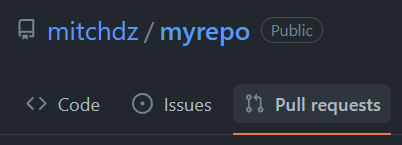

Click 

And then choose the branch you want to merge

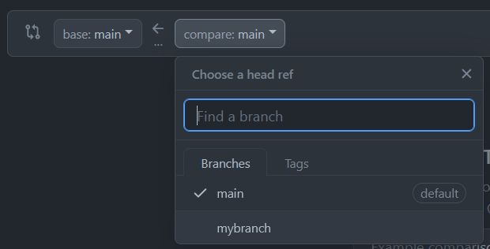

Review the changes,

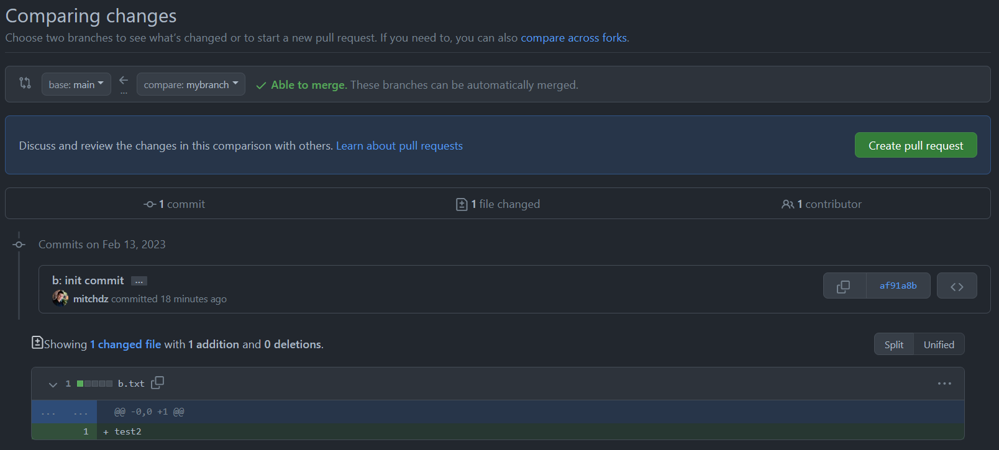

And then simply click  at the top right. Now you will have an "Open pull request" page

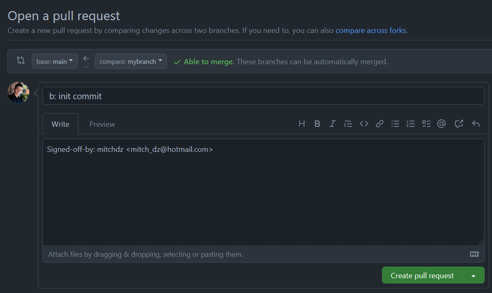

Now click  and you now have the PR created!

Click  to merge your branch into main.

Now we can view this PR in our local branch

## Viewing PR in local
```bash
$ git checkout main # because we were on our own branch
Switched to branch 'main'
Your branch is up to date with 'origin/main'.
$ git pull
remote: Enumerating objects: 1, done.
remote: Counting objects: 100% (1/1), done.
remote: Total 1 (delta 0), reused 0 (delta 0), pack-reused 0
Unpacking objects: 100% (1/1), 618 bytes | 309.00 KiB/s, done.
From github.com:mitchdz/myrepo
   78cad5f..0b740e9  main       -> origin/main
Updating 78cad5f..0b740e9
Fast-forward
 b.txt | 1 +
 1 file changed, 1 insertion(+)
 create mode 100644 b.txt
```

We can view the last commit in our local branch with
```bash
$ git log -1
commit 0b740e938146026a75a8a6153980910222e26ad6 (HEAD -> main, origin/main)
Merge: 78cad5f af91a8b
Author: Mitchell <mitch_dz@hotmail.com>
Date:   Mon Feb 13 12:10:38 2023 -0700

    Merge pull request #1 from mitchdz/mybranch

    b: init commit
```

</details>

---

## Gitignore

<details>
  <summary>Click me to expand</summary>
Gitignore is a useful file that tells your local git to ignore certain files when staging. Often times these will be object files and other things that don't make sense to push to main. Let's explore this.

```bash
$ touch file.o
$ git status
On branch main
Your branch is up to date with 'origin/main'.

Untracked files:
  (use "git add <file>..." to include in what will be committed)
        file.o
```

The file `file.o` is seen with git status, but if we tell git to ignore all files ending with .o by using globbing like so:

```bash
$ echo "*.o" >> .gitignore
$ git status
On branch main
Your branch is up to date with 'origin/main'.

Untracked files:
  (use "git add <file>..." to include in what will be committed)
        .gitignore
```
Git will now ignore these files by default. Of course you can add them if you force it with `-f`.

The `.gitignore` file is something you can push to the repository so everyone collaborating can share a single list of files to exclude.

If you have specific files that only you will see, for example pycharm files, you can add your own exclude list in `.git/info/exclude`. This exclude file will not be commited to main, but will remain in effect for you.

the exclude file works very similar to .gitignore, except you won't see the changes to `exclude` in git status.

```bash
$ touch file.a
$ echo "*.a" >> .git/info/exclude
$ git status
On branch main
Your branch is up to date with 'origin/main'.

Untracked files:
  (use "git add <file>..." to include in what will be committed)
        .gitignore
```


</details>
