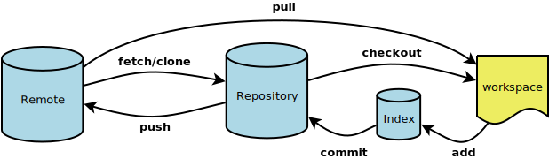

# Git Intro
## What is Git?
Git is an open source distributed **Version Control System** (VCS) that tracks
changes in files. Often used in teams to coordinate work and efficiently
develop code in the same project.

Resources:
* https://illustrated-git.readthedocs.io/en/latest/

## What is GitHub?
Github is a hosting service for git, which also adds a custom frontend and other
advanced features. **git != github.**

## Git Alternatives
When learning about a new technology, it's nice to know the alternatives.

|Alternative|Information|
|-----------|-----|
|Subversion|If you used TortoiseSVN you have used Subversion|
|Mercurial|BitBucket/SourceForge/GNU Octave used this|
|Bazaar|Maintained by Canonical|
|RTC|Rational Team Concert - Made by IBM|
