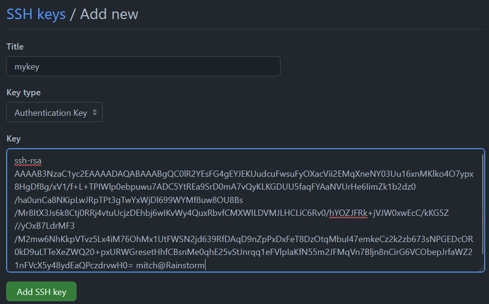

## Setting up SSH Keys

# 1) SSH Keys
SSH keys are great, and you should use them. They aren't scary, so let's go set
one up! publickey authentication consists of a pair of keys

|Key|Meaning|
|-----------|-----|
|Public|This key by default has the `.pub` suffix and is safe to share*|
|Private|Protect this key and ensure no one else gets access to it. This is what logs you in.|

*If someone has your public key, they can't login to anything, however don't
just share your key with random people.

There are many algorithms to key pairs, but today we will be using the tried
and true RSA algorithm.

## 1A) Generating RSA keypair
First, let's generate the key pairs in our `~/.ssh/` folder, so run the following command:
```bash
$ cd ~/.ssh/
```

In your terminal (**Git Bash** if you are using Windows) run the following
command to generate the SSH key pair:

```bash
$ ssh-keygen -t rsa
```
I named the key `mykey` and did not password protect the key (just pressed enter)
```bash
Generating public/private rsa key pair.
Enter file in which to save the key (/c/Users/mitch/.ssh/id_rsa): mykey
Enter passphrase (empty for no passphrase):
Enter same passphrase again:
Your identification has been saved in mykey
Your public key has been saved in mykey.pub
The key fingerprint is:
SHA256:Bro1WkPnemLmPGnZ80lVQ6iNVIbVrcSxBPYQqQ9jfiA mitch@Rainstorm
The key's randomart image is:
+---[RSA 3072]----+
|           +OB+o |
|          ooo=+..|
|      o .. = .=. |
|     o +E O .... |
|    . = S+ =.    |
|     = =  ..o    |
|    o =+. ..     |
|     ==oo. .     |
|     .o. oo      |
+----[SHA256]-----+
```

Now if I look in my $(cwd) I'll see both the public and private key.
```bash
$ ll
total 5
-rw-r--r-- 1 mitch 197609 2602 Feb 13 10:15 mykey
-rw-r--r-- 1 mitch 197609  569 Feb 13 10:15 mykey.pub
```

The key with the `.pub` suffix is the public key which I will enroll with
Github.

First, `cat` the public key so you can copy it
```bash
cat mykey.pub
ssh-rsa AAAAB3NzaC1yc2EAAAADAQABAAABgQC0lR2YEsFG4gEYJEKUudcuFwsuFyOXacVii2EMqXneNY03Uu16xnMKlko4O7ypx8HgDf8g/xV1/f+L+TPIWlp0ebpuwu7ADC5YtREa9SrD0mA7vQyKLKGDUU5faqFYAaNVUrHe6IimZk1b2dz0/ha0unCa8NKipLwJRpTPt3gTwYxWjDl699WYMf8uw8OU8Bs/Mr8ItX3Js6k8Ctj0RRj4vtuUcjzDEhbj6wIKvWy4QuxRbvfCMXWILDVMJLHCLiC6Rv0/hYOZJFRk+jVJW0xwEcC/kKG5Z//yOxB7LdrMF3/M2mw6NhKkpVTvz5Lx4iM76OhMx1UtFWSN2jd639RfDAqD9nZpPxDxFeT8DzOtqMbuI47emkeCz2k2zb673sNPGEDcOR0kD9uLTTeXeZWQ20+pxURWGresetHhfCBsnMe0qhE25vStJnrqq1eFVlpIaKfN55m2JFMqVn7Bljn8nCirG6VCObepJrfaWZ21nFVcX5y48ydEaQPczdrvwH0= mitch@Rainstorm
```
## 1B) Enrolling SSH public key
Now, go to https://github.com/settings/keys


And then enroll your key by adding the name for this keypair (I chose the name of the key) and pasting your publickey



Simply click  and your public key is now enrolled with Github!

# 1C) Configuring local git to use private key
Now that Github has our **Public Key** enrolled, it is time to configure our local git to use our private key. First `cd` to `~/.ssh/`
```bash
cd ~/.ssh/
```
This is where your ssh configuration file will live. Depending on your system, it might be a different path, so let's determine what our path is
```bash
$ echo $PWD
/c/Users/mitch/.ssh
```

For me it's `/c/Users/mitch/.ssh` so I will use that in my configuration file, but it may be different for you.

At this point, use whatever text editor you prefer to create the config file in `~/.ssh/` to look like so:
```bash
$ cat ~/.ssh/config
Host github.com
        User git
        Hostname github.com
        PreferredAuthentications publickey
        IdentityFile C:\Users\mitch\.ssh\mykey
```
Notice how I use `\` instead of `/` here, that's because I'm on Windows. If you're on Mac/Linux then you can use `/`.

That's it! Congratulations on enrolling your key pair. Common mistakes are typos in the config file, and not having the key in the right place. You can double check this by
