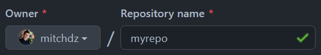
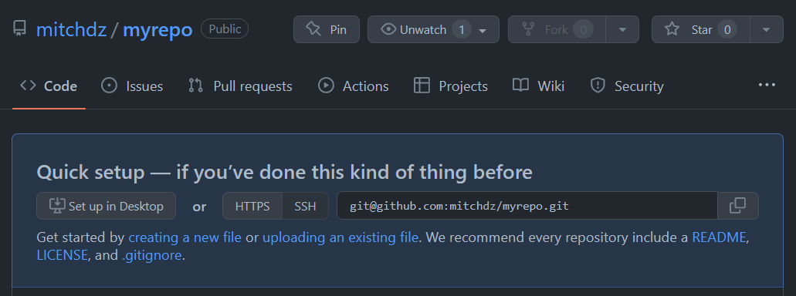
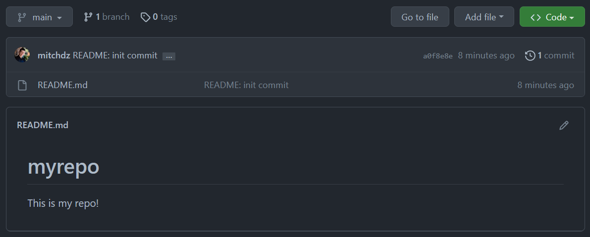

## Creating our first Repo
Now it's time to create our repo!

Go to https://github.com/new, create a repository and give it a name



You can make your repo Private if you want. After this, click Create Repository to create it!


At this point you will see



We will now use our first git command to clone the remote repository. Copy that URL and use `git clone` to download the remote to your local machine.

```bash
$ mkdir -p ~/git/
$ cd ~/git/
$ git clone git@github.com:mitchdz/myrepo.git
```

Now cd to your new repo
```bash
$ cd myrepo # or whatever name you made it
```

And create your first file

```bash
$ vim README.md
# write whatever you want, for example:
$ cat README.md
# myrepo

This is my repo!
```

Now you can use `git status` to see what the working tree looks like

```bash
$ git status
On branch main

No commits yet

Untracked files:
  (use "git add <file>..." to include in what will be committed)
        README.md

nothing added to commit but untracked files present (use "git add" to track)
```

Here we can see `README.md` is in our local repository and unstaged. We can add
The file(s) to staging with `git add`

```bash
$ git add README.md
```

Now check back with `git status`
```bash
$ git status
On branch main

No commits yet

Changes to be committed:
  (use "git rm --cached <file>..." to unstage)
        new file:   README.md
```

At this point, the file `README.md` is in staging and we can add more files
or make other changes. We will proceed to commit these changes to our **local branch** with git commit.

## Making a Commit Message
```bash
$ git commit -s
```

The `-s` flag **s**igns the commit message with your key. This is often required
in certain projects.

Every project has a different guideline for commit messages, so check in
with the project to see what they expect. Here we will use a simple framework
that looks like:

```text
[Files changed]: [brief description]

[More in-depth description]
```

For a real-life example, check out a recent cloud-init commit: https://github.com/canonical/cloud-init/commit/55686b977570a6de69bef51c1e1a9d452333995d

For this exercise, the following commit message is good:
```bash
README: init commit

Initial commit of README.

Signed-off-by: mitchdz <mitch_dz@hotmail.com>

# Please enter the commit message for your changes. Lines starting
# with '#' will be ignored, and an empty message aborts the commit.
#
# On branch main
#
# Initial commit
#
# Changes to be committed:
#       new file:   README.md
#
```

Now we can push our local commit to the remote repository with `git push`

```bash
$ git push
Enumerating objects: 3, done.
Counting objects: 100% (3/3), done.
Writing objects: 100% (3/3), 273 bytes | 273.00 KiB/s, done.
Total 3 (delta 0), reused 0 (delta 0), pack-reused 0
To github.com:mitchdz/myrepo.git
 * [new branch]      main -> main
```

Refresh your github page (the one that gave you the URL) and you will see the
changes!


