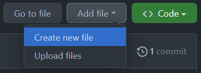
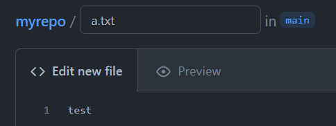
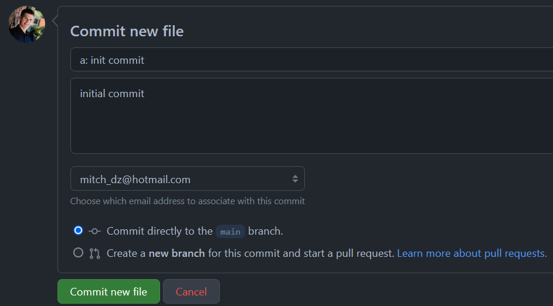
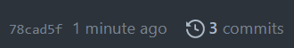
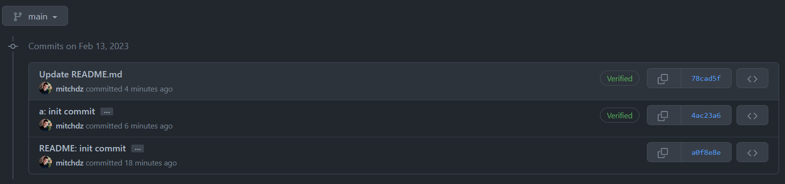

# Pulling remote changes

Now let's simulate working on a project and someone creates a new file and
and modifies and existing one. Go to your Github page and add a file





And commit directly to main



Cool, now the remote has a new file named `a.txt` with the contents "test". Let's also modify the README with the GitHub frontend. Click the pencil icon on the right of the README.md  to start editing. Write whatever you want and commit the changes.

Now at this point you will see 3 commits in the Repository



And you can view the commits by clicking the `3 commits`




## Syncing Remote changes to Local

Okay now let's sync these remote changes to our local branch.

Going back to our terminal (our machine with the local branch) let's see what
`git status` tells us

```bash
$ git status
On branch main
Your branch is up to date with 'origin/main'.

nothing to commit, working tree clean
```

This might be a little misleading, because we just made 2 commits to main! The
Reason for this is because our local branch doesn't know of the changes yet, so
we need to `fetch` those changes.

```bash
$ git fetch
remote: Enumerating objects: 8, done.
remote: Counting objects: 100% (8/8), done.
remote: Compressing objects: 100% (4/4), done.
Unpacking objects: 100% (6/6), 1.29 KiB | 77.00 KiB/s, done.
remote: Total 6 (delta 0), reused 0 (delta 0), pack-reused 0
From github.com:mitchdz/myrepo
   a0f8e8e..78cad5f  main       -> origin/main
```

And now `git status` will tell us that we are behind!

```bash
$ git status
On branch main
Your branch is behind 'origin/main' by 2 commits, and can be fast-forwarded.
  (use "git pull" to update your local branch)

nothing to commit, working tree clean
```

`git status` tells us to run `git pull` but we can actually just run `git merge` here.

`git pull` is actually just a combination of 2 commands: fetch -> merge. For this example, let's use `git merge`

```bash
$ git merge
Updating a0f8e8e..78cad5f
Fast-forward
 README.md | 2 ++
 a.txt     | 1 +
 2 files changed, 3 insertions(+)
 create mode 100644 a.txt
```

Now you should see the new file and any changes you made to README!

```bash
$ ll
total 2
-rw-r--r-- 1 mitch 197609 43 Feb 13 11:39 README.md
-rw-r--r-- 1 mitch 197609  6 Feb 13 11:39 a.txt
```

# Viewing old commits and changing to an old commit
In our local machine, we can view old commits with `git log`

```bash
$ git log
commit 78cad5f52c3aa573f412c03f5f1a5f89a5457a3a (HEAD -> main, origin/main)
Author: Mitchell <mitch_dz@hotmail.com>
Date:   Mon Feb 13 11:17:12 2023 -0700

    Update README.md

commit 4ac23a63894664bdc07932ffeabc97a65726a7d2
Author: Mitchell <mitch_dz@hotmail.com>
Date:   Mon Feb 13 11:15:18 2023 -0700

    a: init commit

    initial commit

commit a0f8e8e3957b48c87397748b881d36d32118b7b2
Author: mitchdz <mitch_dz@hotmail.com>
Date:   Mon Feb 13 11:02:48 2023 -0700

    README: init commit

    Initial commit of README.

    Signed-off-by: mitchdz <mitch_dz@hotmail.com>
```

In my example I can see I am on commit 78cad5f52c3aa573f412c03f5f1a5f89a5457a3a. If I want to go to commit 4ac23a63894664bdc07932ffeabc97a65726a7d2 it is as simple as doing

```bash
$ git checkout 4ac23a63894664bdc07932ffeabc97a65726a7d2
Note: switching to '4ac23a63894664bdc07932ffeabc97a65726a7d2'.
...
```

Now I will see the commit before I updated the README, so those changes should not be present in my local machine.

Doing this detaches our branch from `main` and creates a new branch. We can make changes here if we want, but we can go back to the main branch like so:

```bash
$ git checkout main
```
