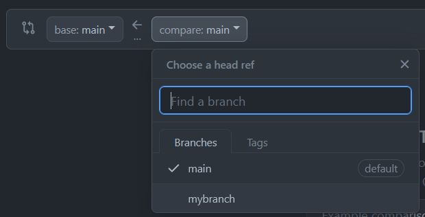
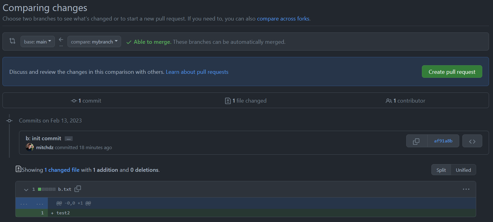
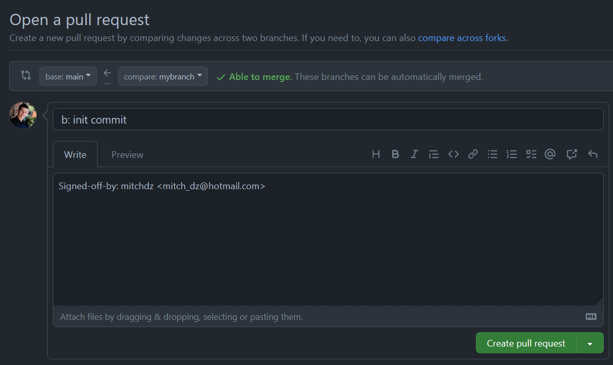

# Creating a Pull Request through Github

A Pull Request for github is a request to merge one branch to another. Typically this is some development branch to the main branch. Go to Github and you will see


Which is handy as it'll do a lot of the work for you, but let's go through the route where GitHub doesn't give this convenient button. Click Pull request up top


Click 

And then choose the branch you want to merge



Review the changes,



And then simply click  at the top right. Now you will have an "Open pull request" page



Now click  and you now have the PR created!

Click  to merge your branch into main.

Now we can view this PR in our local branch

## Viewing PR in local
```bash
$ git checkout main # because we were on our own branch
Switched to branch 'main'
Your branch is up to date with 'origin/main'.
$ git pull
remote: Enumerating objects: 1, done.
remote: Counting objects: 100% (1/1), done.
remote: Total 1 (delta 0), reused 0 (delta 0), pack-reused 0
Unpacking objects: 100% (1/1), 618 bytes | 309.00 KiB/s, done.
From github.com:mitchdz/myrepo
   78cad5f..0b740e9  main       -> origin/main
Updating 78cad5f..0b740e9
Fast-forward
 b.txt | 1 +
 1 file changed, 1 insertion(+)
 create mode 100644 b.txt
```

We can view the last commit in our local branch with
```bash
$ git log -1
commit 0b740e938146026a75a8a6153980910222e26ad6 (HEAD -> main, origin/main)
Merge: 78cad5f af91a8b
Author: Mitchell <mitch_dz@hotmail.com>
Date:   Mon Feb 13 12:10:38 2023 -0700

    Merge pull request #1 from mitchdz/mybranch

    b: init commit
```
